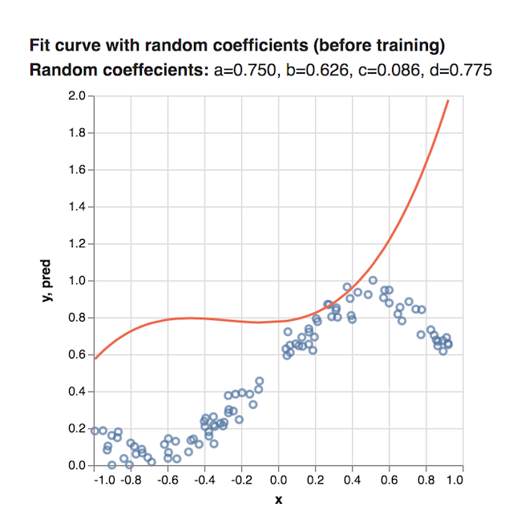

# TensorFlow.js

## 安装

在JavaScript项目中，TensorFlow.js的安装方法有两种：一种是通过script标签引入，另外一种就是通过npm进行安装。

使用Script Tag

将下面的代码添加到HTML文件中，在浏览器中打开该HTML文件，代码应该运行！

```html
<html>
  <head>
    <!-- Load TensorFlow.js -->
    <script src="https://cdn.jsdelivr.net/npm/@tensorflow/tfjs@0.9.0"> </script>

    <!-- Place your code in the script tag below. You can also use an external .js file -->
    <script>
      // Notice there is no 'import' statement. 'tf' is available on the index-page
      // because of the script tag above.

      // Define a model for linear regression.
      const model = tf.sequential();
      model.add(tf.layers.dense({units: 1, inputShape: [1]}));

      // Prepare the model for training: Specify the loss and the optimizer.
      model.compile({loss: 'meanSquaredError', optimizer: 'sgd'});

      // Generate some synthetic data for training.
      const xs = tf.tensor2d([1, 2, 3, 4], [4, 1]);
      const ys = tf.tensor2d([1, 3, 5, 7], [4, 1]);

      // Train the model using the data.
      model.fit(xs, ys).then(() => {
        // Use the model to do inference on a data point the model hasn't seen before:
        // Open the browser devtools to see the output
        model.predict(tf.tensor2d([5], [1, 1])).print();
      });
    </script>
  </head>

  <body>
  </body>
</html>
```

通过NPM（或yarn）

使用yarn或npm将TensorFlow.js添加到您的项目中。注意：因为使用ES2017语法（如import），所以此工作流程假定您使用打包程序/转换程序将代码转换为浏览器可以理解的内容。

```bash
yarn add @tensorflow/tfjs
npm install @tensorflow/tfjs
```

在js文件中输入以下代码：

```js
import * as tf from '@tensorflow/tfjs';

// Define a model for linear regression.
const model = tf.sequential();
model.add(tf.layers.dense({units: 1, inputShape: [1]}));

// Prepare the model for training: Specify the loss and the optimizer.
model.compile({loss: 'meanSquaredError', optimizer: 'sgd'});

// Generate some synthetic data for training.
const xs = tf.tensor2d([1, 2, 3, 4], [4, 1]);
const ys = tf.tensor2d([1, 3, 5, 7], [4, 1]);

// Train the model using the data.
model.fit(xs, ys).then(() => {
  // Use the model to do inference on a data point the model hasn't seen before:
  model.predict(tf.tensor2d([5], [1, 1])).print();
});
```

## 核心概念

TensorFlow.js是一个用于机器智能的开源基于WebGL加速的JavaScript库。它将高性能机器学习构建块带到您的指尖，使您能够在浏览器中训练神经网络或在推理模式下运行预先训练的模型。有关安装/配置TensorFlow.js的指南，请参阅Tensorflow.js 安装。

TensorFlow.js为机器学习提供低级构建模块，以及构建神经网络的高级Keras启发式API。我们来看看库的一些核心组件。

### 张量和变量

张量(Tensor)和变量（Variable）是TensorFlow.js中数据的主要表现形式，两者不同之处在于张量是不可变的，而变量是可变的。

**张量(Tensor)**

TensorFlow.js中数据的中心单位是张量：一组数值形成一个或多个维度的数组。张量实例具有定义数组形状的形状属性。

Tensorflow.js中数据的主要表现形式就是tensor（张量）：由一组数值形成一维或多维数组。一个`Tensor`实例有一个`shape`属性来定义这一组数值如何组成张量,而最主要的`Tensor`实例的构造函数就是`tf.tensor`函数，如下所示：

```js
// 2x3 Tensor
const shape = [2, 3]; // 2 行, 3 列
const a = tf.tensor([1.0, 2.0, 3.0, 10.0, 20.0, 30.0], shape);
a.print(); // 打印张量值
// 输出:    [[1 , 2 , 3 ],
//          [10, 20, 30]]

// shape也可以用下面的方式实现:
const b = tf.tensor([[1.0, 2.0, 3.0], [10.0, 20.0, 30.0]]);
b.print();
// 输出:    [[1 , 2 , 3 ],
//          [10, 20, 30]]
```

但是，为了构造低秩张量，我们推荐使用下面的函数来增强代码的可读性：`tf.scalar（零维）`, `tf.tensor1d（一维）`, `tf.tensor2d（二维）`, `tf.tensor3d（三维）`、`tf.tensor4d（四维）`以及`tf.ones（值全是1）`或者`tf.zeros（值全是0）` ，如下所示：

```js
const a = tf.scalar(3.14);
a.print(); // 输出零维张量

const b = tf.tensor2d([[2, 3, 4], [5, 6, 7]]);
b.print(); // 输出二维张量

const c = tf.zeros([2, 3]);
c.print(); // 输出2行3列的值全是0的张量

const d = tf.ones([3, 5]);
d.print(); // 输出3行5列的值全是1的张量
```

在TensorFlow.js中，张量是不变的; 一旦创建你就不能改变它们的值。 但是，您可以对它们执行操作来生成新的张量。

**变量（Variable**

Variables变量是通过张量进行初始化得到的。不像Tensor的值不可变，变量的值是可变的。你可以使用变量的assign方法分配一个新的tensor到这个变量上，这是变量就会改变：

```js
const initialValues = tf.zeros([5]);
const biases = tf.variable(initialValues); // 初始化biases
biases.print(); // 输出: [0, 0, 0, 0, 0]

const updatedValues = tf.tensor1d([0, 1, 0, 1, 0]);
biases.assign(updatedValues); // 更新 biases的值
biases.print(); // 输出: [0, 1, 0, 1, 0]
```

如上所示，首先使用tf.zeros得到一个张量，然后利用这个张量初始化得到一个变量，接着我们就可以打印这个变量，并且通`Object.prototype.toString.call(biases)`方法可以判断变量也是一个对象，接着，我们再生成一个张量，然后变量调用`assign`方法传入这个张量，就可以得到一个新的变量了，如下：


由此我们可以得出一个结论：变量由张量生成，且张量不可变而变量可变。

### 模型

在Tensorflow.js中，从概念上来说，一个模型就是一个给定一些输入将会产生特定的输出的函数。简单来说，一个模型就是一个函数，只是它完成了特定的任务。

在TensorFlow.js中有两种方式来创建模型，一种是通过操作（ops）来直接完成模型本身所做的工作，另外一种就是通过高级API `tf.model`来创建一个模型，显然第二种是更容易的。

我们先看第一种创建模型的方法：

```js
function predict(input) {
  // y = a * x ^ 2 + b * x + c
  // More on tf.tidy in the next section
  return tf.tidy(() => {
    const x = tf.scalar(input);

    const ax2 = a.mul(x.square());
    const bx = b.mul(x);
    const y = ax2.add(bx).add(c);

    return y;
  });
}

const a = tf.scalar(2);
const b = tf.scalar(4);
const c = tf.scalar(8);

const result = predict(2);
result.print()
```

如上所示，我们定义的predict函数就是一个模型，对于给定的输入，我们就可以得到预测的输出。注意：所有的数字都需要经过tf.scalar()张量处理。

而第二种创建模型的方法就是用 TensorFlow.js 中的 tf.model 方法（这里的model并不是真正可以调用的方法，而是一个总称，比如实际上可以调用的是tf.sequential模型），这在深度学习中是非常流行的概念。 下面的代码就创建了 tf.sequential 模型：

```js
const model = tf.sequential();
model.add(
  tf.layers.simpleRNN({
    units: 20,
    recurrentInitializer: 'GlorotNormal',
    inputShape: [80, 4]
  })
);

const optimizer = tf.train.sgd(LEARNING_RATE);
model.compile({optimizer, loss: 'categoricalCrossentropy'});
model.fit({x: data, y: labels)});
```

### 内存管理

因为TensorFlow.js使用了GPU来加速数学运算，因此当tensorflow处理张量和变量时就有必要来管理GPU内存。在TensorFlow.js中，我们可以通过dispose 和 tf.tidy这两种方法来管理内存。

**dispose**

您可以在张量或变量上调用dispose来清除它并释放其GPU内存：

```js
const x = tf.tensor2d([[0.0, 2.0], [4.0, 6.0]]);
const x_squared = x.square();

x.dispose();
x_squared.dispose();
```

**tf.tidy**

进行大量的张量操作时使用dispose可能会很麻烦。TensorFlow.js提供了另一个函数tf.tidy，它对JavaScript中的常规范围起到类似的作用，不同的是它针对GPU支持的张量。

tf.tidy执行一个函数并清除所有创建的中间张量，释放它们的GPU内存。 它不清除内部函数的返回值。

```js
const average = tf.tidy(() => {
  const y = tf.tensor1d([1.0, 2.0, 3.0, 4.0]);
  const z = tf.ones([4]);

  return y.sub(z).square().mean();
});

average.print()
```

使用tf.tidy将有助于防止应用程序中的内存泄漏。它也可以用来更谨慎地控制内存何时回收。

两个重要的注意事项

- 传递给tf.tidy的函数应该是同步的，并且不会返回Promise。我们建议在tf.tidy内不要有更新UI或在发出远程请求的代码。

- tf.tidy不会清理变量。变量通常持续到机器学习模型的整个生命周期，因此TensorFlow.js不会清理它们，即使它们是在tidy中创建的。不过，您可以手动调用dispose处理它们。

## 训练

### 拟合曲线

这篇文章中，我们将使用TensorFlow.js来根据数据拟合曲线。即使用多项式产生数据然后再改变其中某些数据（点），然后我们会训练模型来找到用于产生这些数据的多项式的系数。简单的说，就是给一些在二维坐标中的散点图，然后我们建立一个系数未知的多项式，通过TensorFlow.js来训练模型，最终找到这些未知的系数，让这个多项式和散点图拟合。

**先决条件**

本教程假定您熟悉核心概念中介绍的TensorFlow.js的基本构建块：张量，变量和操作。 我们建议在完成本教程之前先完成核心概念的学习。

**运行代码**

这篇文章关注的是创建模型以及学习模型的系数，完整的代码在这里可以找到。为了在本地运行，如下所示：

``` bash
$ git clone https://github.com/tensorflow/tfjs-examples
$ cd tfjs-examples/polynomial-regression-core
$ yarn
$ yarn watch
```

即首先将核心代码下载到本地，然后进入polynomial-regression-core（即多项式回归核心）部分，最后进行yarn安装并运行。


**输入数据**

我们的数据集由x坐标和y坐标组成，当绘制在笛卡尔平面上时，其坐标如下所示：


该数据是由三次方程 `y = ax^{3}+ bx^{2} + cx + d` 生成的。

我们的任务是学习这个函数的a，b，c和d系数以最好地拟合数据。 我们来看看如何使用TensorFlow.js操作来学习这些值。

**第1步：设置变量**

首先，我们需要创建一些变量。即开始我们是不知道a、b、c、d的值的，所以先给他们一个随机数，入戏所示：

``` js
const a = tf.variable(tf.scalar(Math.random()));
const b = tf.variable(tf.scalar(Math.random()));
const c = tf.variable(tf.scalar(Math.random()));
const d = tf.variable(tf.scalar(Math.random()));
```

**第2步：建立模型**

我们可以通过TensorFlow.js中的链式调用操作来实现这个多项式方程 `y = ax3 + bx2 + cx + d`，下面的代码就创建了一个 predict 函数，这个函数将x作为输入，y作为输出：

``` js
function predict(x) {
  // y = a * x ^ 3 + b * x ^ 2 + c * x + d
  return tf.tidy(() => {
    return a.mul(x.pow(tf.scalar(3))) // a * x^3
      .add(b.mul(x.square())) // + b * x ^ 2
      .add(c.mul(x)) // + c * x
      .add(d); // + d
  });
}
```

其中，在上一篇文章中，我们讲到tf.tify函数用来清除中间张量，其他的都很好理解。

接着，让我们把这个多项式函数的系数使用之前得到的随机数，可以看到，得到的图应该是这样：



因为开始时，我们使用的系数是随机数，所以这个函数和给定的数据匹配的非常差，而我们写的模型就是为了通过学习得到更精确的系数值。

**第3步：训练模型**

最后一步就是要训练这个模型使得系数和这些散点更加匹配，而为了训练模型，我们需要定义下面的三样东西：

- 损失函数（loss function）：这个损失函数代表了给定多项式和数据的匹配程度。 损失函数值越小，那么这个多项式和数据就跟匹配。
- 优化器（optimizer）：这个优化器实现了一个算法，它会基于损失函数的输出来修正系数值。所以优化器的目的就是尽可能的减小损失函数的值。
- 训练迭代器（traing loop）：即它会不断地运行这个优化器来减少损失函数。

所以，上面这三样东西的 关系就非常清楚了： 训练迭代器使得优化器不断运行，使得损失函数的值不断减小，以达到多项式和数据尽可能匹配的目的。这样，最终我们就可以得到a、b、c、d较为精确的值了。

**定义损失函数**

这篇文章中，我们使用MSE（均方误差，mean squared error）作为我们的损失函数。MSE的计算非常简单，就是先根据给定的x得到实际的y值与预测得到的y值之差 的平方，然后在对这些差的平方求平均数即可。


于是，我们可以这样定义MSE损失函数：

``` js
function loss(predictions, labels) {
  // 将labels（实际的值）进行抽象
  // 然后获取平均数.
  const meanSquareError = predictions.sub(labels).square().mean();
  return meanSquareError;
}
```

即这个损失函数返回的就是一个均方差，如果这个损失函数的值越小，显然数据和系数就拟合的越好。

**定义优化器**

对于我们的优化器而言，我们选用 SGD （Stochastic Gradient Descent）优化器，即随机梯度下降。SGD的工作原理就是利用数据中任意的点的梯度以及使用它们的值来决定增加或者减少我们模型中系数的值。

TensorFlow.js提供了一个很方便的函数用来实现SGD，所以你不需要担心自己不会这些特别复杂的数学运算。 即 tf.train.sdg 将一个学习率（learning rate）作为输入，然后返回一个SGDOptimizer对象，它与优化损失函数的值是有关的。

在提高它的预测能力时，学习率（learning rate）会控制模型调整幅度将会有多大。低的学习率会使得学习过程运行的更慢一些（更多的训练迭代获得更符合数据的系数），而高的学习率将会加速学习过程但是将会导致最终的模型可能在正确值周围摇摆。简单的说，你既想要学的快，又想要学的好，这是不可能的。

下面的代码就创建了一个学习率为0.5的SGD优化器。

``` js
const learningRate = 0.5;
const optimizer = tf.train.sgd(learningRate);
```

**定义训练循环**

既然我们已经定义了损失函数和优化器，那么现在我们就可以创建一个训练迭代器了，它会不断地运行SGD优化器来使不断修正、完善模型的系数来减小损失（MSE）。下面就是我们创建的训练迭代器：

``` js
function train(xs, ys, numIterations = 75) {

  const learningRate = 0.5;
  const optimizer = tf.train.sgd(learningRate);

  for (let iter = 0; iter < numIterations; iter++) {
    optimizer.minimize(() => {
      const predsYs = predict(xs);
      return loss(predsYs, ys);
    });
  }
```

现在，让我们一步一步地仔细看看上面的代码。首先，我们定义了训练函数，并且以数据中x和y的值以及制定的迭代次数作为输入：

``` js
function train(xs, ys, numIterations) {
...
}
```

接下来，我们定义了之前讨论过的学习率（learning rate）以及SGD优化器：

``` js
const learningRate = 0.5;
const optimizer = tf.train.sgd(learningRate);
```

最后，我们定义了一个for循环，这个循环会运行numIterations次训练。在每一次迭代中，我们都调用了optimizer优化器的minimize函数，这就是见证奇迹的地方：

``` js
for (let iter = 0; iter < numIterations; iter++) {
  optimizer.minimize(() => {
    const predsYs = predict(xs);
    return loss(predsYs, ys);
  });
}
```

`minimize` 接受了一个函数作为参数，这个函数做了下面的两件事情：

- 首先它对所有的x值通过我们在之前定义的pridict函数预测了y值。

- 然后它通过我们之前定义的损失函数返回了这些预测的均方误差。

`minimize`函数之后会自动调整这些变量（即系数a、b、c、d）来使得损失函数更小。

在运行训练迭代器之后，a、b、c以及d就会是通过模型75次SGD迭代之后学习到的结果了。

查看结果！

一旦程序运行结束，我们就可以得到最终的a、b、c和d的结果了，然后使用它们来绘制曲线，如下所示：


这个结果已经比开始随机分配系数的结果拟合的好得多了！

### 图片训练

这篇文章中，我们将使用CNN构建一个Tensorflow.js模型来分辨手写的数字。首先，我们通过使之“查看”数以千计的数字图片以及他们对应的标识来训练分辨器。然后我们再通过此模型从未“见到”过的测试数据评估这个分辨器的精确度。

**运行代码**

这篇文章的全部代码可以在仓库TensorFlow.js examples 中的tfjs-examples/mnist 下找到，你可以通过下面的方式clone下来然后运行这个demo：

``` bash
$ git clone https://github.com/tensorflow/tfjs-examples
$ cd tfjs-examples/mnist
$ yarn
$ yarn watch
```

上面的这个目录完全是独立的，所以完全可以copy下来然后创建你个人的项目。

**数据相关**

这里我们将会使用  MNIST  的手写数据，这些我们将要去分辨的手写数据如下所示：

  

为了预处理这些数据，我们已经写了 data.js， 这个文件包含了Minsdata类，而这个类可以帮助我们从MNIST的数据集中获取到任意的一些列的MNIST。

而MnistData这个类将全部的数据分割成了训练数据和测试数据。我们训练模型的时候，分辨器就会只观察训练数据。而当我们评价模型时，我们就仅仅使用测试数据，而这些测试数据是模型还没有看见到的，这样就可以来观察模型预测全新的数据了。

这个MnistData有两个共有方法：

1. nextTrainBatch(batchSize)： 从训练数据中返回一批任意的图片以及他们的标识。

2. nextTestBatch(batchSize):  从测试数据中返回一批图片以及他们的标识。

::: warning 注意
当我们训练MNIST分辨器时，应当注意数据获取的任意性是非常重要的，这样模型预测才不会受到我们提供图片顺序的干扰。例如，如果我们每次给这个模型第一次都提供的是数字1，那么在训练期间，这个模型就会简单的预测第一个就是1（因为这样可以减小损失函数）。 而如果我们每次训练时都提供的是2，那么它也会简单切换为预测2并且永远不会预测1（同样的，也是因为这样可以减少损失函数）。如果每次都提供这样典型的、有代表性的数字，那么这个模型将永远也学不会做出一个精确的预测。
:::

**创建模型**

在这一部分，我们将会创建一个卷积图片识别模型。为了这样做，我们使用了 `Sequential` 模型（模型中最为简单的一个类型），在这个模型中，张量（tensors）可以连续的从一层传递到下一层中。

首先，我们需要使用 `tf.sequential` 先初始化一个 `Sequential` 模型：

``` js
const model = tf.sequential();
```

既然我们已经创建了一个模型，那么我们就可以添加层了。

**添加第一层**

我们要添加的第一层是一个2维的卷积层。卷积将过滤窗口掠过图片来学习空间上来说不会转变的变量（即图片中不同位置的模式或者物体将会被平等对待）。

我们可以通过 `tf.layers.conv2d` 来创建一个2维的卷积层，这个卷积层可以接受一个配置对象来定义层的结构，如下所示：

``` js
model.add(tf.layers.conv2d({
  inputShape: [28, 28, 1],
  kernelSize: 5,
  filters: 8,
  strides: 1,
  activation: 'relu',
  kernelInitializer: 'VarianceScaling'
}));
```

让我们拆分对象中的每个参数吧：

- `inputShape`：这个数据的形状将回流入模型的第一层。在这个示例中，我们的MNIST例子是28 x 28像素的黑白图片，这个关于图片的特定的格式即 `[row, column, depth]`，所以我们想要配置一个 `[28, 28, 1]`的形状，其中28行和28列是这个数字在每个维度上的像素数，且其深度为1，这是因为我们的图片只有1个颜色:

- `kernelSize`：划过卷积层过滤窗口的数量将会被应用到输入数据中去。这里，我们设置了 `kernalSize` 的值为 `5`，也就是指定了一个5 x 5的卷积窗口。

- `filters`：这个 `kernelSize` 的过滤窗口的数量将会被应用到输入数据中，我们这里将8个过滤器应用到数据中。

- `strides`： 即滑动窗口每一步的步长。比如每当过滤器移动过图片时将会由多少像素的变化。这里，我们指定其步长为1，这意味着每一步都是1像素的移动。

- `activation`：这个activation函数将会在卷积完成之后被应用到数据上。在这个例子中，我们应用了relu 函数，这个函数在机器学习中是一个非常常见的激活函数。

- `kernelInitializer` ：这个方法对于训练动态的模型是非常重要的，他被用于任意地初始化模型的 weights。我们这里将不会深入细节来讲，但是 `VarianceScaling`（即这里用的）真的是一个初始化非常好的选择。

**添加第二层**

让我们为这个模型添加第二层：一个最大的池化层（pooling layer），这个层中我们将通过 `tf.layers.maxPooling2d` 来创建。这一层将会通过在每个滑动窗口中计算最大值来降频取样得到结果。

``` js
model.add(tf.layers.maxPooling2d({
  poolSize: [2, 2],
  strides: [2, 2]
}));
```

- `poolSize`：这个滑动池窗口的数量将会被应用到输入的数据中。这里我们设置 `poolSize` 为 `[2, 2]`，所以这就意味着池化层将会对输入数据应用2x2的窗口。

- `strides`：这个池化层的步长大小。比如，当每次挪开输入数据时窗口需要移动多少像素。这里我们指定 `strides` 为 `[2, 2]`，这就意味着过滤器将会以在水平方向和竖直方向上同时移动2个像素的方式来划过图片。

::: warning 注意
因为 `poolSize` 和 `strides` 都是2x2，所以池化层空口将会完全不会重叠。这也就意味着池化层将会把激活的大小从上一层减少一半。
:::

**添加剩下的层**

重复使用层结构是神经网络中的常见模式。我们添加第二个卷积层到模型，并在其后添加池化层。请注意，在我们的第二个卷积层中，我们将滤波器数量从8增加到16。还要注意，我们没有指定 `inputShape`，因为它可以从前一层的输出形状中推断出来：

``` js
model.add(tf.layers.conv2d({
  kernelSize: 5,
  filters: 16,
  strides: 1,
  activation: 'relu',
  kernelInitializer: 'VarianceScaling'
}));

model.add(tf.layers.maxPooling2d({
  poolSize: [2, 2],
  strides: [2, 2]
}));
```

接下来，我们添加一个 `flatten` 层，将前一层的输出平铺到一个向量中：

``` js
model.add(tf.layers.flatten());
```

最后，让我们添加一个 `dense` 层（也称为全连接层），它将执行最终的分类。 在dense层前先对卷积+池化层的输出执行flatten也是神经网络中的另一种常见模式：

``` js
model.add(tf.layers.dense({
  units: 10,
  kernelInitializer: 'VarianceScaling',
  activation: 'softmax'
}));
```

我们来分析传递给 `dense` 层的参数。

- `units`：激活输出的数量。由于这是最后一层，我们正在做10个类别的分类任务（数字0-9），因此我们在这里使用10个units。 （有时units被称为神经元的数量，但我们会避免使用该术语。）

- `kernelInitializer`：我们将对dense层使用与卷积层相同的 `VarianceScaling` 初始化策略。

- `activation`：分类任务的最后一层的激活函数通常是 softmax。 Softmax将我们的10维输出向量归一化为概率分布，使得我们10个类中的每个都有一个概率值。

**定义优化器**

对于我们的卷积神经网络模型，我们将使用学习率为0.15的随机梯度下降（SGD）优化器：

```js
const LEARNING_RATE = 0.15;
const optimizer = tf.train.sgd(LEARNING_RATE);
```

**定义损失函数**

对于损失函数，我们将使用通常用于优化分类任务的交叉熵（ categoricalCrossentropy）。 categoricalCrossentropy度量模型的最后一层产生的概率分布与标签给出的概率分布之间的误差，这个分布在正确的类标签中为1（100％）。 例如，下面是数字7的标签和预测值：

|class     | 0 | 1 | 2 | 3 | 4 | 5 | 6 | 7 | 8 | 9 |
|---------:|--:|--:|--:|--:|--:|--:|--:|--:|--:|--:|
|label     | 0 | 0 | 0 | 0 | 0 | 0 | 0 | 1 | 0 | 0 |
|prediction|.1 |.01|.01|.01|.20|.01|.01|.60|.03|.02|

如果预测的结果是数字7的概率很高，那么categoricalCrossentropy会给出一个较低的损失值，而如果7的概率很低，那么categoricalCrossentropy的损失就会更高。在训练过程中，模型会更新它的内部参数以最小化在整个数据集上的categoricalCrossentropy。

**定义评估指标**

对于我们的评估指标，我们将使用准确度，该准确度衡量所有预测中正确预测的百分比。

**编译模型**

为了编译模型，我们传入一个由优化器，损失函数和一系列评估指标（这里只是'精度'）组成的配置对象：

```js
model.compile({
  optimizer: optimizer,
  loss: 'categoricalCrossentropy',
  metrics: ['accuracy'],
});
```

**配置批量大小**

在开始训练之前，我们需要定义一些与batch size相关的参数：

```js
const BATCH_SIZE = 64;
const TRAIN_BATCHES = 100;
const TEST_BATCH_SIZE = 1000;
const TEST_ITERATION_FREQUENCY = 5;
```

*进一步了解分批量和批量大小*

为了充分利用GPU并行化计算的能力，我们希望将多个输入批量处理，并使用单个前馈网络调用将他们馈送到网络。

我们批量计算的另一个原因是，在优化过程中，我们只能在对多个样本中的梯度进行平均后更新内部参数（迈出一步）。这有助于我们避免因错误的样本（例如错误标记的数字）而朝错误的方向迈出了一步。

当批量输入数据时，我们引入秩D + 1的张量，其中D是单个输入的维数。

如前所述，我们MNIST数据集中单个图像的维度为[28,28,1]。当我们将BATCH_SIZE设置为64时，我们每次批量处理64个图像，这意味着我们的数据的实际形状是[64,28,28,1]（批量始终是最外层的维度）。

::: warning 注意
回想一下在我们的第一个conv2d配置中的inputShape没有指定批量大小（64）。 Config被写成批量大小不可知的，以便他们能够接受任意大小的批次。
:::

**编写训练循环**

以下是训练循环的代码：

```js
for (let i = 0; i < TRAIN_BATCHES; i++) {
  const batch = data.nextTrainBatch(BATCH_SIZE);

  let testBatch;
  let validationData;

  if (i % TEST_ITERATION_FREQUENCY === 0) {
    testBatch = data.nextTestBatch(TEST_BATCH_SIZE);
    validationData = [
      testBatch.xs.reshape([TEST_BATCH_SIZE, 28, 28, 1]), testBatch.labels
    ];
  }

  const history = await model.fit(
      batch.xs.reshape([BATCH_SIZE, 28, 28, 1]),
      batch.labels,
      {
        batchSize: BATCH_SIZE,
        validationData,
        epochs: 1
      });

  const loss = history.history.loss[0];
  const accuracy = history.history.acc[0];

}
```

让我们分析代码。 首先，我们获取一批训练样本。 回想一下上面说的，我们利用GPU并行化批量处理样本，在对大量样本进行平均后才更新参数：

```js
const batch = data.nextTrainBatch(BATCH_SIZE);
```

每5个step（TEST_ITERATION_FREQUENCY），我们构造一次validationData，这是一个包含一批来自MNIST测试集的图像及其相应标签这两个元素的数组，我们将使用这些数据来评估模型的准确性：

```js
if (i % TEST_ITERATION_FREQUENCY === 0) {
  testBatch = data.nextTestBatch(TEST_BATCH_SIZE);
  validationData = [
    testBatch.xs.reshape([TEST_BATCH_SIZE, 28, 28, 1]),
    testBatch.labels
  ];
}
```

`model.fit` 是模型训练和参数实际更新的地方。

::: warning 注意
在整个数据集上执行一次model.fit会导致将整个数据集上传到GPU，这可能会使应用程序死机。 为避免向GPU上传太多数据，我们建议在for循环中调用model.fit()，一次传递一批数据，如下所示：
:::

```js
const history = await model.fit(
  batch.xs.reshape([BATCH_SIZE, 28, 28, 1]), batch.labels,
  {batchSize: BATCH_SIZE, validationData: validationData, epochs: 1});
```

我们再来分析一下这些参数：

- `x`：输入图像数据。请记住，我们分批量提供样本，因此我们必须告诉fit函数batch有多大。 MnistData.nextTrainBatch返回形状为[BATCH_SIZE，784]的图像 —— 所有的图像数据是长度为784（28 * 28）的一维向量。但是，我们的模型预期图像数据的形状为[BATCH_SIZE，28,28,1]，因此我们需要使用reshape函数。

- `y`：我们的标签;每个图像的正确数字分类。

- `batchSize`：每个训练batch中包含多少个图像。之前我们在这里设置的BATCH_SIZE是64。

- `validationData`：每隔TEST_ITERATION_FREQUENCY（这里是5）个Batch，我们构建的验证集。该数据的形状为[TEST_BATCH_SIZE，28,28,1]。之前，我们设置了1000的TEST_BATCH_SIZE。我们的评估度量（准确度）将在此数据集上计算。

- `epochs`：批量执行的训练次数。由于我们分批把数据馈送到fit函数，所以我们希望它每次仅从这个batch上进行训练。
每次调用fit的时候，它会返回一个包含指标日志的对象，我们把它存储在history。我们提取每次训练迭代的损失和准确度，以便将它们绘制在图上：

```js
const loss = history.history.loss[0];
const accuracy = history.history.acc[0];
```

查看结果！

如果你运行完整的代码，你应该看到这样的输出：


### Keras模型

Keras模型（通常通过Python API创建）的存储格式可以有多种， 其中“整个模型”（即架构+权重+优化器状态都存在一个文件内）格式可以转换为 TensorFlow.js Layers格式，可以直接加载到TensorFlow.js中进行推理或进一步训练。

TensorFlow.js Layers格式是一个包含 `model.json` 文件和一组二进制格式的权重文件分片的目录。 `model.json`文件包含模型拓扑结构（又名“体系结构”或“图”：层的描述以及它们如何连接）以及权重文件的清单。

**要求**

运行模型格式转换程序需要Python环境;如果你想要一个独立的环境，你可以使用pipenv或virtualenv。要安装转换器，请使用这个命令 `pip install tensorflowjs`。

将Keras模型导入TensorFlow.js可以分为两个步骤。首先，将现有的Keras模型转换为TF.js Layers格式，然后将其加载到TensorFlow.js中。

**第一步：将Keras模型转换为TF.js Layers格式**

Keras模型通常使用 `model.save(filepath)` 保存，它生成一个包含模型拓扑结构和权重的HDF5（.h5）文件。要将这样的文件转换为TF.js Layer格式，请运行以下命令，其中 `path/to/my_model.h5` 是Keras .h5源文件，`path/to/tfjs_target_dir` 是TF.js文件的输出目录：

```bash
tensorflowjs_converter --input_format keras \
                       path/to/my_model.h5 \
                       path/to/tfjs_target_dir
```

**另一个方案：使用Python API直接导出为TF.js Layers格式**

如果您在Python中使用Keras模型，则可以将其直接导出为TensorFlow.js Layers格式，如下所示：

```python
import tensorflowjs as tfjs

def train(...):
    model = keras.models.Sequential()   # for example
    ...
    model.compile(...)
    model.fit(...)
    tfjs.converters.save_keras_model(model, tfjs_target_dir)
```

**第二步：将模型加载到TensorFlow.js中**

使用Web服务器来为您在步骤1中生成的转换模型文件提供服务。请注意，为了允许JavaScript获取文件，您可能需要配置服务器以允许跨源资源共享（CORS）。

然后通过提供model.json文件的URL将模型加载到TensorFlow.js中：

```js
// JavaScript

import * as tf from '@tensorflow/tfjs';

const model = await tf.loadModel('https://foo.bar/tfjs_artifacts/model.json');
```

现在该模型已准备好进行推理，评估或重新训练。例如，加载的模型可以立即用于预测：

```js
// JavaScript

const example = tf.fromPixels(webcamElement);  // for example
const prediction = model.predict(example);
```

TensorFlow.js Examples中的很多例子都采用此方法，使用已在Google云端存储上转换并托管的预训练模型。

请注意，您使用 `model.json` 文件名来引用整个模型。`loadModel(...)` 获取 `model.json`，然后发出额外的HTTP（S）请求以获取 `model.json` 权重清单中引用的权重文件分片。这种方法允许所有这些文件被浏览器缓存（也可能通过互联网上的其他缓存服务器），因为 `model.json` 和weight shard分别小于典型的缓存文件大小限制。因此，模型可能会在随后的场合更快加载。

**支持的功能**

TensorFlow.js Layers目前仅支持使用标准Keras构造的Keras模型。使用了不受支持的操作或层（例如自定义层，Lambda层，自定义损失或自定义指标）的模型将无法自动导入，因为它们所依赖的Python代码无法正确地转换为JavaScript。
